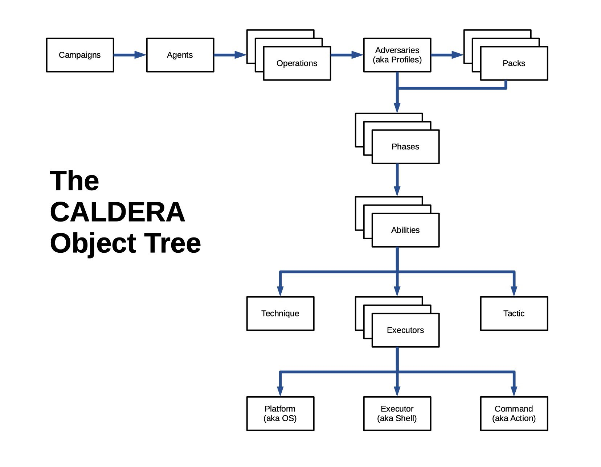

# Caldera


> 项目地址: https://github.com/mitre/caldera

Caldera 基于 MITER ATT&CK 框架构建，是 MITER 一项活跃的研究项目。

- Server -> Python / Implant -> Go

- Multi-User、Web UI(Restful API)、Golang Based Max Agent、ATT&CK



Install:

```bash
git clone https://github.com/mitre/caldera.git --recursive --branch v2.9.0
cd caldera
pip3 install -r requirements.txt
python3 server.py --insecure
```

