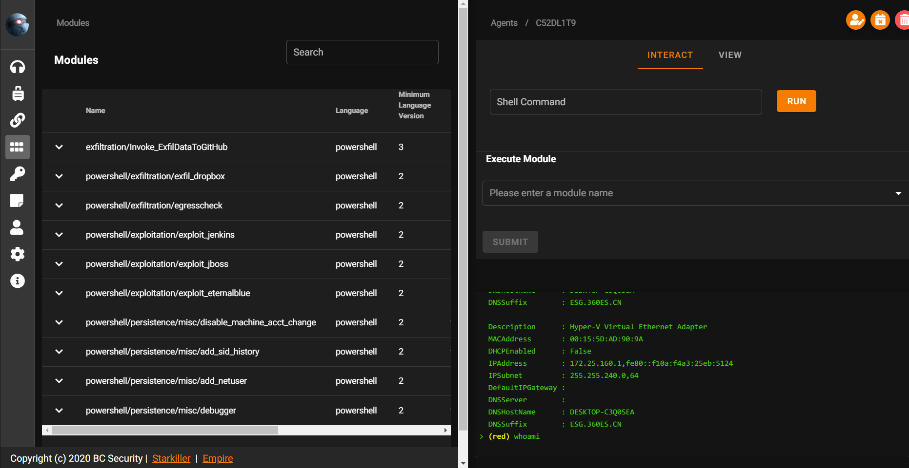

# Empire

> 项目地址：https://github.com/BC-SECURITY/Empire

> GUI 支持：https://github.com/BC-SECURITY/Starkiller

Empire 3 是一个后渗透框架，包括纯 PowerShell Windows 代理，并与 Python 3.x Linux / OS X Agent 兼容。

Empire 实现了 **无需 powershell.exe 就可运行 PowerShell 代理**的功能，可快速部署后期漏洞利用模块，从键盘记录器到 Mimikatz，并且能够适应通信躲避网络检测，所有的这些功能都封装在一个以实用性为重点的框架中。

- Server -> Python / Implant -> Powershell
- Multi-User & GUI (& Srarkiller)、全平台
- Listener 仅支持 http，dropbox / http / http_com / http_foreign / http_hop / http_malleable / http_mapi / 
meterpreter / onedrive / redirector
- 内置 315 模块、bypassUAC、pth/wmi/psexec/psremoting ...

Install:

```sh
git clone https://github.com/BC-SECURITY/Empire.git
cd Empire
sudo ./setup/install.sh
# curl -sSL https://raw.githubusercontent.com/python-poetry/poetry/master/get-poetry.py | python -
# /root/.poetry/bin/poetry
sudo poetry install
sudo poetry run python3 empire --rest --username red --password admin
# nohup /root/.poetry/bin/poetry run python3 empire --rest --username red --password admin 2>&1 >log.txt &
```


